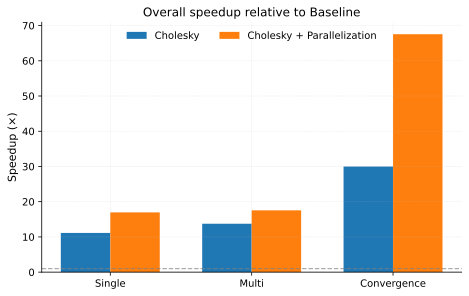

# Optimization of Simulation for the Adaptive Reference-Guided Estimator

Umich STATS 607 Unit 3 Project, Fall 2025

This project optimizes the simulation of Unit 2 Project, which is based on [**Yoon and Jung (2025)**](https://onlinelibrary.wiley.com/doi/full/10.1002/sta4.70081).
It implements two optimization strategies:
1. **Cholesky Decomposition** for generating multivariate normal samples
2. **Parallelization**

For details, see the paper, `ADEMP.md` and `OPTIMIZATION.md`.

The simulation results are saved in `results/`, and runtime results are saved in `timings/`.

---

## Performance Summary of the Optimization Strategies



Using Cholesky decomposition yields a 10–15× speedup for the single- and multi-spike simulations, and nearly a 30× speedup for the convergence-rate study. The smaller gain in the single and multi simulations is expected: each contains both Normal and Student-t cases, and the Student-t generator already uses a Cholesky-based implementation. Therefore, the true improvement over the naïve np.`random.multivariate_normal` implementation is best reflected in the ~30× speedup observed in the convergence experiment. Parallelization provides an additional ≈2× speedup, which is beneficial but more modest than expected—likely due to overhead and the relatively small task sizes per core.


---

## Setup Instructions

1. **Clone or open the repository**, then create a Python environment:
   ```bash
   python3 -m venv .venv
   source .venv/bin/activate
   ```

2. **Install required packages**:
   ```bash
   pip install -r requirements.txt
   ```

   The following packages are needed:
   ```
   numpy>=1.24
   pandas>=2.0
   tqdm>=4.65
   matplotlib>=3.7
   pytest>=8.0
   ```
   (Python ≥ 3.9 recommended)

---

## How to Run the Complete Analysis

This project is fully automated via the included **Makefile**.

Run the full pipeline:
```bash
make all
```

This command performs the following steps:
1.	Run all simulations
(src/simulation_baseline.py, src/simulation_cholesky.py, src/simulation_cholesky+parallelization.py)
→ Saves result tables under results/tables/ and raw runtime logs under timings/tables/.
2.	Generate result figures
(src/plot.py)
→ Saves plots under results/figures/.
3.	Aggregate runtime profiling data
(performance/profiling.py)
→ Writes profiling tables to timings/tables/.
4.	Generate profiling figures
(performance/plot_profiling.py)
→ Saves plots under timings/figures/.
5.	Compute log–log complexity estimates
(performance/complexity.py)
→ Produces complexity.csv in timings/tables/.
6.	Generate complexity figures
(performance/plot_complexity.py)
→ Saves plots under timings/figures/.

You can also run individual steps:
```bash
make simulate_baseline                 # Run baseline simulation
make simulate_cholesky                 # Run Cholesky simulation
make simulate_cholesky_parallelization # Run Cholesky + parallelization simulation

make result_figures                    # Generate figures from simulation results
make profiling_figures                 # Generate figures from runtime profiling
make complexity_figures                # Generate complexity plots

make profile                           # Build aggregated profiling CSVs
make complexity                        # Compute complexity metrics

make clean                             # Remove all generated outputs
make test                              # Run test suite
```

---


